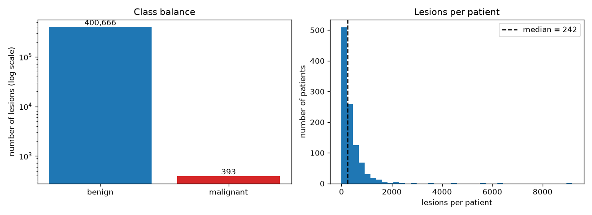
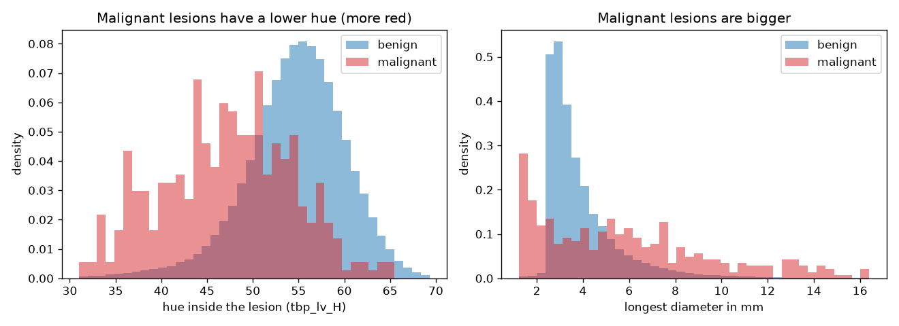
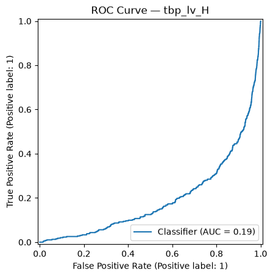
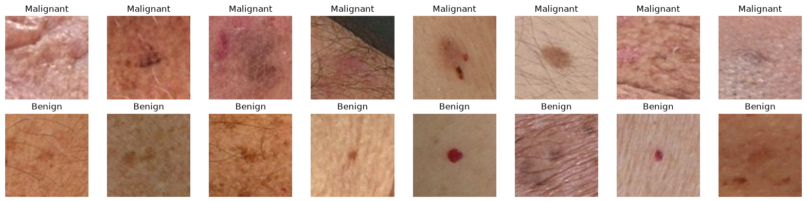
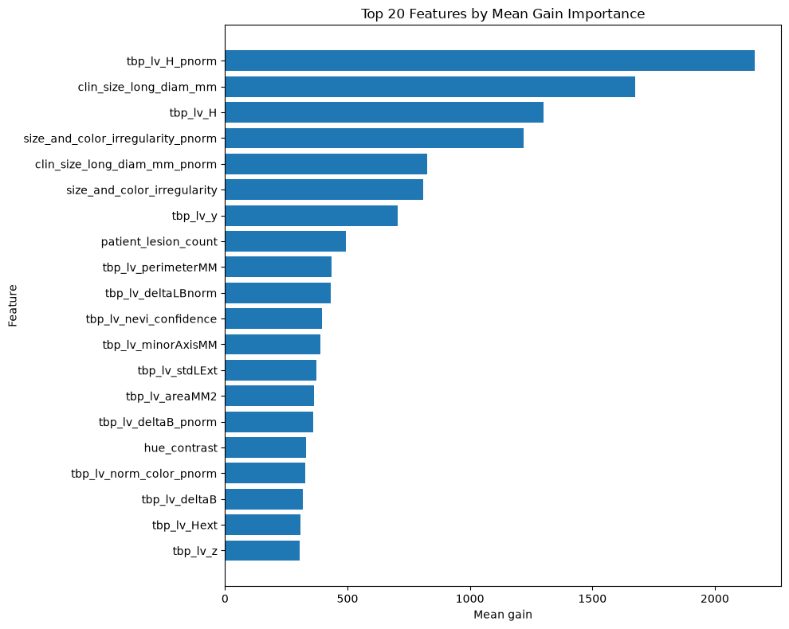
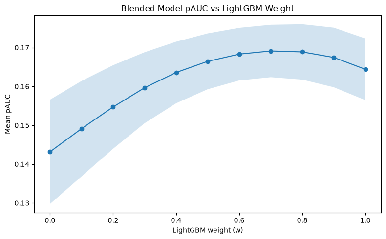

# Skin Cancer Detection from 3D Total Body Photos (ISIC 2024)

Machine Learning Engineer Nanodegree - Capstone Project Report

## 1. Definition

### Project Overview

Skin cancer is the most common type of cancer, and melanoma is the deadliest form of it. When melanoma is found
early, the five-year survival rate is about 99%. Once it spreads it is much harder to treat, and an estimated
8,510 people in the U.S. will die of it in 2026 [1].

Deep learning has worked well for this before. Esteva et al. [2] trained a CNN that classified skin cancer about
as well as dermatologists. The earlier ISIC challenges used dermoscopy images, which are close-up photos taken by
dermatologists with a special device. The ISIC 2024 challenge [4] uses the SLICE-3D dataset [3], where the
lesions are cropped from 3D total body photos. These crops look more like phone photos, so a model trained on
them could also be useful where there is no dermatologist, for example in primary care or telehealth.

In this project I used the metadata and the images of this dataset to rank skin lesions by how likely they are
to be malignant.

### Problem Statement

A 3D total body photo has hundreds of lesions per patient (about 385 on average here), and a dermatologist can't
look at every one of them. The goal is triage: rank the lesions so the most suspicious ones are checked first.

It is a binary classification task. The input is the image crop of a lesion and its metadata (age, sex, body site
and measurements from the scanner). The output is a score for how likely the lesion is malignant.

My plan was:
1. Explore the data and remove columns that leak the answer.
2. Split the data into 5 folds by patient and set up two benchmarks.
3. Train LightGBM on the metadata and improve it step by step.
4. Train a CNN on the images.
5. Combine both and compare everything on the same folds.
6. Train, tune and deploy the models on SageMaker.

### Metrics

There is about 1 malignant lesion for every 1,000 benign ones. A model that always says "benign" would be 99.9%
accurate and find no cancer at all, so accuracy is useless here.

The main metric is the partial AUC (pAUC) above 80% TPR, which is the official metric of the competition [5]. The
ROC curve plots the share of cancers caught (TPR) against the share of benign lesions wrongly flagged (FPR). The
pAUC only counts the area where at least 80% of the cancers are caught. This fits screening, where missing a
cancer is much worse than a false alarm. It goes from 0 to 0.2. I also report the normal ROC-AUC because it is
easier to read. Both only depend on how the lesions are ranked, so the imbalance doesn't affect them.

All results are the mean ± standard deviation over the 5 patient folds.

## 2. Analysis

### Data Exploration

The data is from the Kaggle competition "ISIC 2024 - Skin Cancer Detection with 3D-TBP" [4] (CC BY-NC 4.0).

- 401,059 lesions: 400,666 benign and 393 malignant.
- 1,042 patients with about 385 lesions each (median about 240). Only 259 patients have a malignant lesion.
- Every lesion has a small JPEG crop (around 3 KB, between about 110 and 150 pixels wide).
- Every lesion has metadata: age, sex, body site and about 35 measurements from the 3D scanner (`tbp_lv_*`) for
  color, size, shape, border and position on the body.
- `age_approx` has 2,798 missing values.
- The test file only has 3 example rows. The real test set is hidden on Kaggle.

**Leaky columns.** Some columns are only in the training data: the diagnosis (`iddx_*`), the pathology results
(`mel_mitotic_index`, `mel_thick_mm`), `lesion_id` and `tbp_lv_dnn_lesion_confidence`. They are only known after a
biopsy, so they can't be used. `mel_thick_mm` for example only has a value for 63 lesions and all of them are
malignant. `lesion_id` is less obvious: only 5.5% of the lesions have one, but all 393 malignant ones do, because
it is given to lesions that a doctor tagged. I dropped all of these columns.

**Single-feature AUC.** To see which features are useful on their own, I computed the AUC of every numeric column
against the target. 0.5 means no signal. Below 0.5 means lower values are more likely malignant.

| Feature | AUC | Direction |
|---|---|---|
| `tbp_lv_H` (hue inside the lesion) | 0.195 | lower = malignant |
| `tbp_lv_deltaB` (B contrast inside vs outside) | 0.246 | lower = malignant |
| `tbp_lv_Hext` (hue outside the lesion) | 0.280 | lower = malignant |
| `tbp_lv_B` (B inside the lesion) | 0.288 | lower = malignant |
| `tbp_lv_stdLExt` (lightness variation outside) | 0.662 | higher = malignant |
| `tbp_lv_nevi_confidence` (scanner's "normal mole" score) | 0.354 | lower = malignant |

Hue goes from red (about 25) to brown (about 75), so malignant lesions tend to be more red than brown. If I take
a random malignant and a random benign lesion, the malignant one has the lower hue about 80% of the time.

### Exploratory Visualization

*Left: the classes on a log scale, otherwise the 393 malignant lesions would not be visible. Right: most patients
have a few hundred lesions, some more than a thousand.*

*Hue and diameter for both classes. Malignant lesions are more red and bigger, but the classes overlap a lot, so
one feature alone is not enough.*

*ROC curve of `tbp_lv_H` used directly as a score. It is below the diagonal (AUC 0.195) because a lower hue means
malignant. With the sign flipped the AUC is 0.805.*

*8 random malignant (top) and 8 random benign (bottom) crops. The malignant ones are often bigger with uneven
colors and blurry borders. Most benign ones are small brown spots, but some are bright red dots, so red alone
doesn't mean malignant. The quality is low and some lesions are hard to see even for me.*

### Algorithms and Techniques

**Patient-based cross-validation.** Photos of the same patient share the same skin tone and camera conditions.
With a random split the same patient would be in training and validation, and the model could partly learn to
recognize the patient instead of the lesion. I used `StratifiedGroupKFold` with 5 folds, so every patient is in
exactly one fold and every fold has a similar number of malignant lesions.

**LightGBM.** LightGBM builds many small decision trees one after another, where each tree corrects the mistakes
of the ones before. I used it for the metadata because boosted trees are usually the best models for tabular
data. It can learn combinations of features, which logistic regression can't, it handles missing values and
categorical columns, and one 5-fold run takes less than a minute on my laptop.

**CNN.** For the images I used a ResNet18 pretrained on ImageNet with the last layer replaced by one output. A
pretrained network can be fine-tuned with few images, and I only have 393 malignant ones. ResNet18 is small,
which fits the small images.

**Combining the models.** LightGBM sees the measurements and the CNN sees the picture, so they should make
different mistakes. I tried two ways:
- *Blending:* both predictions are turned into ranks between 0 and 1 and averaged with a weight. I used ranks
  because the scores of the two models are on different scales.
- *Stacking:* the CNN prediction is added as a feature to LightGBM.

Both use out-of-fold predictions, so every lesion is scored by a model that didn't see it in training.

### Benchmark

I used two benchmarks on the same 5 folds:

1. **`tbp_lv_H` alone:** no training, the lesions are just ranked by the flipped hue.
2. **Logistic regression** on the 34 numeric metadata features (mean imputation and scaling fitted on the
   training folds only).

| Benchmark | pAUC (mean ± std) | AUC (mean ± std) |
|---|---|---|
| `tbp_lv_H` (no training) | 0.0809 ± 0.0247 | 0.8035 ± 0.0490 |
| Logistic regression | 0.1116 ± 0.0205 | 0.8684 ± 0.0363 |

The scores change a lot between folds (0.045 to 0.120 for `tbp_lv_H`), because a fold only has about 80
malignant lesions. So a new model should beat the benchmark on most folds and not only on average.

## 3. Methodology

### Data Preprocessing

- Dropped the leaky columns.
- Made the 5 patient folds (seed 42) and saved them to a file so every model uses the same split. Each fold has
  77 to 83 malignant lesions and about 208 patients. I checked that no patient is in two folds.
- Categorical columns for LightGBM: `anatom_site_general`, `sex`, `tbp_tile_type`, `tbp_lv_location`. I did not
  use the ids, `image_type` (same value everywhere), or `attribution` and `copyright_license`. Those two say which
  hospital the photo is from, and I didn't want the model to learn "hospital X has more cancer".
- Missing values stay as they are for LightGBM. For the logistic regression they are filled with the mean.
- Images are resized to 128x128 and normalized with the ImageNet mean and std. For training they are also flipped,
  rotated up to 15 degrees and slightly color jittered, since a lesion can be photographed from any angle.

### Implementation

**LightGBM.** I wrote one cross-validation function and used it for every version, so only the feature list
changes. It trains on 4 folds, predicts the 5th and computes the pAUC. Settings: 300 trees, learning rate 0.05, 31
leaves, 80% row and column subsampling. I didn't use early stopping on the validation fold because that would
make the scores look better than they are.

**Problem 1: the first LightGBM model was worse than the benchmarks.** With the default settings it only got a
pAUC of 0.036. With so few malignant lesions the trees memorized them instead of learning general patterns. I
tried two fixes:

| Setting | pAUC (mean ± std) |
|---|---|
| Default | 0.0364 ± 0.0057 |
| Benign lesions downsampled to 1% | 0.1577 ± 0.0091 |
| More regularization (`min_child_samples=100`, `reg_lambda=3`) | 0.1542 ± 0.0167 |
| Both | 0.1550 ± 0.0095 |

Downsampling keeps all malignant lesions and 1% of the benign ones in the training folds. The validation fold
is not changed. The three fixes are within 0.004 of each other, which is less than the std, so I took
downsampling alone because it is the simplest and about 100 times faster. A side effect is that the scores are
too high to be real probabilities. The ranking is still fine.

**CNN.** Same folds. For each fold one ResNet18 is trained for 5 epochs (AdamW, learning rate 1e-4, batch size 64,
mixed precision) on all malignant lesions plus 20 random benign ones per malignant one, about 6,600 images. Then it
predicts the whole validation fold (about 80,000 images). I developed it on my laptop GPU first.

**Problem 2: tied predictions.** At first the prediction also ran in float16. Most scores are close to 0, and
float16 only keeps about 3 digits, so only about 4,000 different scores were left for 80,000 lesions. I changed the
prediction to float32. The pAUC didn't change, but ties would have been bad for the rank blending.

**SageMaker.** I turned the notebook code into scripts (`train_lgbm.py`, `train_cnn.py`) and ran them as training
jobs with the PyTorch 2.5.1 container, with the data in S3. Each job runs the 5-fold cross-validation, prints the
pAUC as a metric and saves the fold models and out-of-fold predictions.
- The LightGBM job (`ml.m5.xlarge`, spot) gave exactly the same pAUC as on my laptop (0.1644).
- The CNN job was supposed to run on a `ml.g4dn.xlarge` spot instance. For 25 minutes AWS only answered
  "Insufficient capacity error", so I stopped it and ran it on-demand (12 minutes).
- All 14 training jobs cost about $0.18. Spot saved about 73% on the LightGBM jobs.

### Refinement

**LightGBM v2: engineered features.** Based on the ABCD rules that dermatologists use (Asymmetry, Border, Color,
Diameter) I added 6 features: hue and chroma contrast between the lesion and the skin around it, elongation,
texture contrast, diameter times color irregularity, and a sum of the border, color and asymmetry scores.

**LightGBM v3: "ugly duckling" features.** Dermatologists look for the lesion that looks different from the
patient's other lesions. For 12 columns I computed `(value - patient mean) / patient std`, and I added the number
of lesions per patient. This doesn't use the target and a patient is only in one fold, so it is not a leak.

| Model | fold 0 | fold 1 | fold 2 | fold 3 | fold 4 | pAUC (mean ± std) |
|---|---|---|---|---|---|---|
| LightGBM v1 (downsampled) | 0.1702 | 0.1494 | 0.1594 | 0.1639 | 0.1455 | 0.1577 ± 0.0091 |
| LightGBM v2 (+ engineered) | 0.1760 | 0.1469 | 0.1625 | 0.1643 | 0.1489 | 0.1597 ± 0.0107 |
| LightGBM v3 (+ ugly duckling) | 0.1688 | 0.1529 | 0.1689 | 0.1741 | 0.1573 | 0.1644 ± 0.0079 |

The engineered features only gave +0.002, which is inside the noise. The ugly duckling features gave +0.005 and
a lower std. That is still less than one std, so it is a small improvement.

*Gain importance of LightGBM v3, averaged over the 5 fold models.*

The most important feature is `tbp_lv_H_pnorm`, the hue compared to the patient's other lesions. It is more
important than the hue itself (3rd). The diameter is 2nd, and the number of lesions per patient (8th) is a known
risk factor for melanoma, so the model's choices make sense.

**CNN.** The CNN alone got 0.1432 ± 0.0134. That is better than the logistic regression on all folds, using only
the images, but below LightGBM. On fold 1 the CNN was better than LightGBM.

**Blending.** The rank correlation of the two models is only 0.46, so they do rank the lesions differently. I tried
every weight from 0 to 1.

*Mean pAUC for different LightGBM weights (band = ± one std). 0 is the CNN alone, 1 is LightGBM alone.*

The best weight is 0.7 with a pAUC of 0.1691 ± 0.0067. Between 0.6 and 0.8 the curve is flat, so the exact
weight doesn't matter much. I picked the weight on the same predictions I evaluate on, which is a bit optimistic.

**Stacking.** With the CNN score as a LightGBM feature I got 0.1703 ± 0.0098. Adding the CNN score compared to
the patient's other lesions gave 0.1694, so no gain, although these two were the most important features of that
model. They mostly carry the same information. Stacking also has a small leak, because the CNN scores of the
training rows come from CNNs that saw the validation fold.

**Hyperparameter tuning.** On SageMaker I tuned 6 LightGBM parameters with Bayesian search (12 jobs, pAUC as
objective). I decided before to only switch if the tuned model is more than 0.002 better, because the best of 12
runs on the same folds is partly luck. The best was 0.1624 and all 12 were between 0.158 and 0.162, below the
default (0.1644). So I kept the default parameters.

| Model | fold 0 | fold 1 | fold 2 | fold 3 | fold 4 | pAUC (mean ± std) |
|---|---|---|---|---|---|---|
| Logistic regression | 0.1346 | 0.1054 | 0.1363 | 0.0855 | 0.0964 | 0.1116 ± 0.0205 |
| LightGBM v3 | 0.1688 | 0.1529 | 0.1689 | 0.1741 | 0.1573 | 0.1644 ± 0.0079 |
| CNN | 0.1496 | 0.1586 | 0.1516 | 0.1350 | 0.1212 | 0.1432 ± 0.0134 |
| Blend (0.7 / 0.3) | 0.1744 | 0.1633 | 0.1752 | 0.1738 | 0.1588 | **0.1691 ± 0.0067** |
| Stacking | 0.1791 | 0.1632 | 0.1777 | 0.1773 | 0.1544 | 0.1703 ± 0.0098 |

## 4. Results

### Model Evaluation and Validation

**Final model.** The final model is the blend with 70% LightGBM and 30% CNN. Stacking had a slightly higher mean
(0.1703 vs 0.1691), but the difference is much smaller than the variation between folds. I chose the blend
because it is more stable (std 0.0067 vs 0.0098), has the better worst fold (0.1588 vs 0.1544), doesn't have the
leak, and is simpler.

- LightGBM: 300 trees, learning rate 0.05, 31 leaves, 57 features, trained on all malignant and 1% of the benign
  lesions.
- CNN: ResNet18, 128x128 images, 5 epochs, learning rate 1e-4, 20 benign lesions per malignant one.
- For new data the 5 fold models of each type are averaged and then blended.

The blend has a pAUC of 0.1691 ± 0.0067 (maximum 0.2) and an AUC of 0.959. In practice this means: to catch 80% of
the malignant lesions the model flags about 5% of the benign ones, and for 90% about 10%.

**How I checked that the result can be trusted:**
- *New patients:* all scores are from validation patients the models never saw. The worst fold of the blend
  (0.1588) is better than the best fold of the logistic regression (0.1363).
- *Blend weight:* the result is almost the same for weights from 0.6 to 0.8.
- *Other benign samples:* LightGBM trained on 5 different samples of benign lesions gave 0.1649 instead of 0.1644.
- *Training again on SageMaker:* LightGBM gave exactly the same score. The CNN did not. On SageMaker it got 0.1315
  ± 0.0213 instead of 0.1432 with the same code (other GPU and PyTorch version). The blend of the SageMaker models
  was 0.1658 ± 0.0088. So LightGBM is stable, but the CNN changes from run to run, and the blend gains less when
  the CNN run is weaker.
- *Kaggle's hidden test set:* I submitted the SageMaker models to the competition as a late submission. Kaggle
  runs a notebook on about 500,000 lesions from new patients (`src/kaggle_inference.py`). It scored **0.1706 on
  the public part and 0.1590 on the private part**. My cross-validation (0.166 to 0.169) is between the two.
  The competition is very close at the top: the best public score is 0.189, and a silver medal on the private
  leaderboard starts at 0.1705, so my private score is about 0.011 below that. Scores are lower on the private
  part for everyone, the top teams also drop from about 0.187 to about 0.171. So the model works on new data about as well as the cross-validation
  said, but it is far from the best solutions.

**Deployment.** I deployed the final model to a SageMaker endpoint (`ml.m5.large`). A request has all lesions of
one patient with their images, because of the ugly duckling features, and the answer is one score per lesion. In a
test with two patients the malignant lesion was ranked 1st of 114 and 2nd of 130. This only shows that the
endpoint works, because these patients were in the training data. I deleted the endpoint after the test.

### Justification

| Model | pAUC (mean ± std) | AUC |
|---|---|---|
| `tbp_lv_H` benchmark | 0.0809 ± 0.0247 | 0.804 |
| Logistic regression benchmark | 0.1116 ± 0.0205 | 0.868 |
| Final model (blend) | 0.1691 ± 0.0067 | 0.959 |

The final model beats the logistic regression on all 5 folds, by 0.039 to 0.088. The mean goes from 0.1116 to
0.1691, which is 52% more. A paired t-test on the 5 fold scores gives t = 6.4 and p = 0.003, so this is very
unlikely to be chance. The std is also only a third of the benchmark's.

In the proposal I wrote that good Kaggle solutions reached about 0.15 to 0.17. The final model is in that range,
both in cross-validation and on Kaggle's hidden test set, but at the lower end: the medal solutions are at 0.17
and above on the private part and mine is at 0.159.

I think the model solves the problem as I defined it: most malignant lesions end up near the top of a patient's
list. It can't replace a doctor. When 80% of the cancers are caught, 1 in 5 is still missed. It is a tool that
tells a doctor where to look first.

## 5. Conclusion

### Reflection

I built a model that ranks skin lesions by how likely they are to be malignant. I explored the data, removed the
leaky columns, split by patient, set up benchmarks, built LightGBM step by step, trained a CNN, combined both and
then trained, tuned and deployed everything on SageMaker.

The most interesting part for me was the ugly duckling idea. The hue of a lesion compared to the patient's other
lesions was the most important feature, more than the hue itself. That is the rule dermatologists use, and the
model found it in the data.

The hardest part was the imbalance:
- The first LightGBM model was worse than the benchmark because it memorized the few malignant lesions.
  Downsampling fixed it, and that was the biggest improvement of the whole project.
- With about 80 malignant lesions per fold the scores are noisy. I had to compare models fold by fold and stop
  trusting differences smaller than the std. Engineered features, stacking and tuning all looked like small gains
  or losses that were really just noise.
- The CNN was the least stable part. Longer training didn't help, and the SageMaker run gave a different score.

On the AWS side I learned to test the scripts locally before paying for jobs. The SageMaker jobs then ran without
errors the first time. I also learned that spot instances are cheap but not always there: the CPU jobs got them
right away, the GPU job never did.

### Improvement

- **A more stable CNN.** Train it with several seeds and average them. A bigger network or older ISIC datasets
  with more malignant images could also help.
- **More boosting models.** The best Kaggle solutions also blended XGBoost and CatBoost. I tried this after the
  submission, see section 6.
- **Calibration.** Because of the downsampling the scores are not real probabilities.
- **A separate test set.** I compared many models on the same 5 folds. A group of patients kept out of all
  development would give a cleaner final number than the cross-validation.
- **Closing the gap to the top Kaggle solutions.** They are about 0.011 better on the private test set. From their
  write-ups this mostly comes from stronger image models, more engineered features and blending several boosting
  models.
- **Nested cross-validation for stacking**, to remove the leak.
- **Batch transform** instead of a real-time endpoint for scoring many patients at once.

If my final model was the new benchmark, I think a better solution exists, mostly on the image side. The metadata
model seems close to its limit, since neither tuning nor more features moved it by more than the noise.

## 6. After the Submission

After the project was reviewed I added two notebooks. The final model above is unchanged.

### More boosting models and features

In `08_boosting_ensemble.ipynb` I tried what I listed under improvements: XGBoost and CatBoost next to LightGBM,
a wider feature set (126 features instead of 57) and 5 seeds for every model.

| Model | pAUC (mean ± std) |
|---|---|
| LightGBM, wide features, 5 seeds | 0.1669 ± 0.0108 |
| XGBoost, wide features, 5 seeds | 0.1660 ± 0.0099 |
| CatBoost, wide features, 5 seeds | 0.1654 ± 0.0115 |
| Average of the three | 0.1670 ± 0.0107 |
| Average of the three + CNN (0.7 / 0.3) | 0.1705 ± 0.0083 |
| Final model of this report | 0.1691 ± 0.0067 |

- The three libraries are nearly the same model on this data. Their average is not better than LightGBM alone.
- With the CNN the new version is 0.0014 above the final model. A bootstrap over patients gives an interval
  from -0.0008 to +0.0034 for this difference, so I can't tell it apart from noise.
- On Kaggle it scored 0.1745 on the public part and 0.1604 on the private part (before: 0.1706 and 0.1590). The
  private gain is again +0.0014.

So the boosting side was not the missing piece. The gap to the medal solutions is still about 0.010, and what
is left is the image model.

### Questions the score doesn't answer

In `09_questions.ipynb` I looked at what the pAUC of 0.169 hides. Intervals are from a bootstrap over patients.

| Question | Result |
|---|---|
| How noisy is the score? | One std is about 0.004. Blend vs LightGBM is a real difference, stacking vs blend is not. |
| Cancer, or "a doctor found it suspicious"? | Against benign lesions that were also biopsied the pAUC drops from 0.169 to 0.118. |
| A hospital the model never saw? | LightGBM drops from 0.164 to 0.150 (interval of the drop: 0.009 to 0.019). |
| How many lesions does the ugly duckling need? | The gain only shows for patients with more than about 680 lesions. |
| Skin tone, age, sex? | No clear differences, but the groups are too small to be sure. |
| Which cancer types? | The CNN adds about 8% of the cancers for every type. Melanoma is missed most often. |

The second row changed how I see the result. Every malignant lesion was biopsied, but 95% of the benign ones
never were, because nobody found them suspicious. The model ranks the biopsied benign lesions high as well
(median rank 0.82). So the score mostly measures how well it separates cancers from lesions nobody was worried
about. On the hard cases it is still much better than guessing (AUC 0.88), but it can't replace the decision to
biopsy.

Two statements in this report are weaker than I wrote them. The gain from the patient-normalized features
(0.1597 to 0.1644) is not clearly above 0 over all patients, it only shows for patients with many lesions. And
0.164 is the score for hospitals that are in the training data. For a new hospital 0.150 is the more honest
number.

## References

[1] Skin Cancer Foundation. Skin Cancer Facts & Statistics.
https://www.skincancer.org/skin-cancer-information/skin-cancer-facts/

[2] Esteva, A., Kuprel, B., Novoa, R. A., Ko, J., Swetter, S. M., Blau, H. M., & Thrun, S. (2017).
Dermatologist-level classification of skin cancer with deep neural networks. Nature, 542(7639), 115-118.
https://doi.org/10.1038/nature21056

[3] Kurtansky, N. R., D'Alessandro, B. M., Gillis, M. C., et al. (2024). The SLICE-3D dataset: 400,000 skin
lesion image crops extracted from 3D TBP for skin cancer detection. Scientific Data, 11.
https://doi.org/10.1038/s41597-024-03743-w

[4] ISIC 2024 - Skin Cancer Detection with 3D-TBP. Kaggle.
https://www.kaggle.com/competitions/isic-2024-challenge

[5] ISIC Research. ISIC 2024 Challenge primary metric (pAUC).
https://github.com/ISIC-Research/Challenge-2024-Metrics
